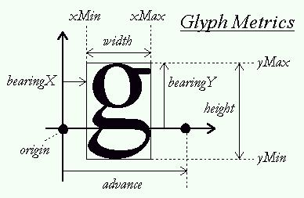

## Debug

```c++
#define ASSERT(x) if(!(x)) __debugbreak();
#define GLCall(x) GLClearError();\
		x;\
		ASSERT(GLLogCall(#x, __FILE__, __LINE__))
void GLClearError();
bool GLLogCall(const char* function, const char* file, int line);

void GLClearError()
{
	while (glGetError() != GL_NO_ERROR);
}

bool GLLogCall(const char* function, const char* file, int line)
{
	while (GLenum error = glGetError())
	{
		std::cout << "[OpenGL Error] (" << error << "): " <<
			function << " file: " << file << "  line: " << line << std::endl;
		return false;
	}
	return true;
}
```


## 顶点缓冲 VertexBuffer

```c++
unsigned int vbo;
glGenBuffers(1, &vbo);				// 创建缓冲对象  可以创建复数个
glCreateBuffers(1, &vbo);			// 与glGenBuffers作用一样
glBindBuffer(GL_ARRAY_BUFFER, vbo);	// 绑定
// 参数1可以是table1之一
glBufferData(GL_ARRAY_BUFFER, size, data, GL_STATIC_DRAW);
// 分配空间
// 如果data不为NULL 同时将data指向的数据写入申请的空间
// 参数4可以是table2之一

glBufferStorage(GL_ARRAY_BUFFER, size, data, GL_STATIC_DRAW);	// 与glBufferData作用相同

glDeleteBuffer(1, &vbo); // 释放buffer
```

## 索引缓冲 ElementBuffer

```c++
unsigned int ebo;
glGenBuffers(1, &ebo);
glBindBuffer(GL_ELEMENT_ARRAY_BUFFER, ebo);
glBufferData(GL_ELEMENT_ARRAY_BUFFER, count * sizeof(unsigned int), data, GL_STATIC_DRAW);
glDeleteBuffer(1, &ebo);
```

## 顶点数组 VertexArray

```c++
unsigned int vao;
glGenVertexArrays(1, &vao);

// 先绑定顶点缓冲和索引缓冲
glBindBuffer(GL_ARRAY_BUFFER, vbo);
glBindBuffer(GL_ELEMENT_BUFFER, ebo);
// 设置顶点属性
for()
{
	glVertexAttribPointer(i, attr.count , attr.type, attr.bNormalize,m_stride, (void*)offset);
	glEnableVertexAttribArray(i);
}
glDeleteVertexArrays(1, &vao);
```

## 着色器 Shader

### 着色器的初始化

```c++
// 创建着色器程序对象
unsigned int shaderProgram = glCreateProgram();

// 创建着色器对象
unsigned int verShader;
verShader = glCreateShader(GL_VERTEX_SAHDER);
// 加载着色器代码
std::string strShaderSource;
GetShaderSource(path, strShaderSource);
const char* strSource = strShaderSource.c_str();
// 将代码绑定到着色器
glShaderSource(verShader, 1, &strSource, NULL);
// 编译着色器
glCompileShader(verShader);
// 编译查错
int success;
char infoLog[512];
glGetShaderiv(nShaderID, GL_COMPILE_STATUS, &success);
if (!success)
{
	glGetShaderInfoLog(verShader, 512, NULL, infoLog);
	std::cout << strType << " compile error!\n" << infoLog << std::endl;
}

// 将着色器对象附加到着色器程序对象
glAttachShader(shaderProgram, verShader);

// 链接
glLinkProgram(shaderProgram);

// 启用着色器程序
glUseProgram(shaderProgram);

// 删除着色器程序
glDeleteProgram(shaderProgram);
```

### 从文件读取着色器代码的函数

```c++
	void Shader::GetShaderSource(const std::string& path, std::string& shaderSource)
	{
		std::ifstream infile;
		std::stringstream sstr;
		infile.open(path, std::ios::in);
		if (infile)
		{
			while (!infile.eof())
			{
				std::string str_t;
				getline(infile, str_t);
				sstr << str_t << '\n';
			}
		}
		else
		{
			std::cout << "Can't open file" << "\" " << path << "\" !" << std::endl;
			infile.close();
			__debugbreak();
			return;
		}

		shaderSource = sstr.str();
		infile.close();
		return;
	}
```

### Uniform变量的赋值

```c++
// 获得变量位置
int location = glGetUniformLocation(shaderProgram, valueName);
if(location == -1)	// 没有找到变量名
{
    std::cout << "Can't find uniform value '" << valueName << "' !" << std::endl;
}

// 设置变量value
glUniformXxxxxxx(location, ... );

// 优化
std::unordered_map<std::string, int> m_UniformMapLocation; // 使用散列表记录变量位置
int location = GetUniformLocation(valueName);
int Shader::GetUniformLocation(const std::string& valueName)
	{
		if (m_UniformMapLocation.find(valueName) != m_UniformMapLocation.end())
			return m_UniformMapLocation[valueName];

		GLCall(int location = glGetUniformLocation(m_ShaderID, valueName.c_str()));
		if (location == -1)
		{
			std::cout << "Can't find uniform value '" << valueName << "' !" << std::endl;
		}
		m_UniformMapLocation[valueName] = location;
		return location;
	}
```

## 细分着色器

### 细分控制着色器


## 2D纹理 Texture

```c++
unsigned int texture;
glGenTextures(1, &texture);				// 生成纹理对象
glActiveTexture(GL_TEXTURE0 + index);	// 激活纹理单元0~79
glBindTexture(GL_TEXTURE_2D, texture);	// 将纹理对象绑定到激活的纹理单元
glTexImage2D(GL_TEXTURE_2D, 0, texColorMode, m_nWidth, m_nHeight, 0, resColorMode, GL_UNSIGNED_BYTE, img_data);								// 开辟空间并写入纹理数据

// 设置纹理属性
glTexParameteri(GL_TEXTURE_2D, GL_TEXTURE_WRAP_S, GL_REPEAT);
glTexParameteri(GL_TEXTURE_2D, GL_TEXTURE_WRAP_T, GL_REPEAT);		// 设置环绕方式

glTexParameteri(GL_TEXTURE_2D, GL_TEXTURE_MIN_FILTER, GL_LINEAR);
glTexParameteri(GL_TEXTURE_2D, GL_TEXTURE_MAG_FILTER, GL_LINEAR);	// 设置插值方式

glGenerateMipmap(GL_TEXTURE_2D);	// 自动生成多级渐远级别纹理(mipmap)
```

如果不调用`glGenerateMipmap(GL_TEXTURE_2D);`会报错。<font color = "red">存疑</font>


### 环绕方式和插值方式

一个纹理对象的环绕方式和插值方式必须要由用户定义。

**环绕方式**`GL_TEXTURE_WRAP_S` `GL_TEXTURE_WRAP_T`.可以是`GL_CLAMP_TO_EDGE`, `GL_CLAMP_TO_BORDER`, `GL_MIRRORED_REPEAT`, `GL_REPEAT`, or `GL_MIRROR_CLAMP_TO_EDGE`

对于立方体纹理，还有第三维的环绕方式`GL_TEXTURE_WRAP_R`.可以是 `GL_CLAMP_TO_EDGE`, `GL_CLAMP_TO_BORDER`, `GL_MIRRORED_REPEAT`, `GL_REPEAT`, or `GL_MIRROR_CLAMP_TO_EDGE`

设置border颜色

```c++
float color[4] = {0.3f, 0.3f, 0.4f ,1.0f};
glTexParameterfv(GL_TEXTURE_2D, GL_TEXTURE_BORDER_COLOR, color);
```

**插值方式**

`GL_TEXTURE_MIN_FILTER`,`GL_TEXTURE_MAG_FILTER`

对于`GL_TEXTURE_MAG_FILTER` 只能是

`GL_NEAREST`,从最邻近的像素取值

`GL_LINEAR`,线性插值

对于`GL_TEXTURE_MIN_FILTER`

`GL_NEAREST`邻近像素

`GL_LINEAR`线性插值

`GL_NEAREST_MIPMAP_NEAREST`选择最邻近的mipmap然后取临近像素

`GL_LINEAR_MIPMAP_NEAREST`选择最邻近的mipmap然后线性插值

`GL_NEAREST_MIPMAP_LINEAR`选择最邻近的两个mipmap分别线性插值，得到两个值，然后取这两个值的平均

`GL_LINEAR_MIPMAP_LINEAR`选择最邻近的两个mipmap分别线性插值，得到两个值，然后取这两个值的加权平均（线性插值）

## 2D纹理数组 2D Texture Array

采样器使用`Sampler2DArray`. 纹理坐标的第三维度为整数，是数组索引。

### 在文字渲染的应用

```c++
for(int i =0;i<128;i++)
		{
			char ch = (char)i;
			if (FT_Load_Char(face, ch, FT_LOAD_RENDER))
				std::cout << "[error] Failed to load Glyph.\n";
			m_TypeAttrib[(size_t)ch].width = face->glyph->bitmap.width;
			m_TypeAttrib[(size_t)ch].height = face->glyph->bitmap.rows;
			m_TypeAttrib[(size_t)ch].beartingY = face->glyph->bitmap_top;
			m_TypeAttrib[(size_t)ch].character = ch;
			GLCall(glTexSubImage3D(GL_TEXTURE_2D_ARRAY, 0, 
				0, 0, i, 
				m_TypeAttrib[(size_t)ch].width, m_TypeAttrib[(size_t)ch].height, 1,
				GL_RED, GL_UNSIGNED_BYTE, face->glyph->bitmap.buffer));
		}
```

### 着色器

```glsl
#version 330 core

in vec2 TexCoord;

out vec4 FragColor;
uniform sampler2DArray u_Tex;
uniform float u_TexIdx;	// 整数  是一个索引
void main()
{
	float f = texture(u_Tex, vec3(TexCoord, u_TexIdx)).r;
	FragColor = vec4(1.0f, 1.0f, 1.0f,f);

}
```


## 几何着色器

### 示例代码

```c
#version 330 core
layout(points) in;							// 从顶点着色器的输入类型
layout(line_strip, max_vertices = 2) out;	// 输入到片段着色器的图元类型

void main()
{
    gl_Position = gl_in[0].gl_Position + vec4(-0.1f, 0.0f, 0.0f, 0.0f);
    EmitVertex();							// 第一个图元的第一个输出顶点
    
    gl_Position = gl_in[0].gl_Position + vec4(0.1f, 0.0f, 0.0f, 0.0f);
    EmitVertex();							// 第一个图元的第二个输出顶点
    
    EndPrimitive();
    // 结束当前图元
}
```

### 输入图元类型

输入隐式定义为

```glsl
in gl_PerVertex
{
    vec4 gl_Position;
    float gl_PointSize;
    float gl_ClipDistance[];
    float gl_CullDistance[];
} gl_in[];
```

**最少顶点数**即gl_in[]数组的大小

| 输入图元            | 最少顶点数 | 对应的GL_XXXX                                          |
| ------------------- | ---------- | ------------------------------------------------------ |
| points              | 1          | `GL_POINTS`                                            |
| lines               | 2          | `GL_LINES`, `GL_LINE_STRIP`                            |
| lines_adjacency     | 4          | `GL_LINES_ADJACENCY`, `GL_LINES_STRIP_ADJACENCY`       |
| triangles           | 3          | `GL_TRIANGLES`, `GL_TRIANGLES`, `GL_TRIANGLE_FAN`      |
| triangles_adjacency | 6          | `GL_TRIANGLE_ADJACENCY`, `GL_TRIANGLE_STRIP_ADJACENCY` |

#### 输入变量必须是数组

**示例**

顶点着色器

```glsl
#version 330 core
layout(location = 0) in vec2 aCoord;
layout(location = 1) in vec4 aColor;

uniform mat4 u_ProjectionTrans;
uniform mat4 u_ViewTrans;

out vec4 Color;

void main()
{
	gl_Position = u_ProjectionTrans * u_ViewTrans * vec4(aCoord, 0.0f, 1.0f);
	Color = aColor;
}
```

几何着色器

```glsl
#version 330 core
layout(points) in;
layout(triangle_strip, max_vertices = 4) out;

uniform float u_Width;

in vec4 Color[];
out vec4 GColor;

void main()
{
	gl_Position = gl_in[0].gl_Position;
	GColor = Color[0];
	EmitVertex();
	
	gl_Position = gl_in[0].gl_Position + vec4(u_Width, 0.0f, 0.0f, 0.0f);
	GColor = Color[0];
	EmitVertex();
	gl_Position = gl_in[0].gl_Position + vec4(0.0f,u_Width, 0.0f, 0.0f);
	
	GColor = Color[0];
	EmitVertex();
	
	gl_Position = gl_in[0].gl_Position + vec4(u_Width, u_Width, 0.0f, 0.0f);
	GColor = Color[0];
	EmitVertex();
	
	EndPrimitive();
}
```


### 输出图元类型

输出隐式定义为

```glsl
out gl_PerVertex
{
    vec4 gl_Position;
    float gl_PointSize;
    float gl_ClipDistance[];
    float gl_CullDistance[];
};
```

输出图元：

`points`, `line_strip`, `triangle_strip`


## 变换

```c++
// M
glm::mat4 modelTrans(1.0f);
modelTrans = glm::translate(modelTrans, glm::vec3(x, y, z));	// 平移 
modelTrans = glm::rotate(modelTrans, PI/2.0f, glm::vec3(x, y,z));	// 旋转
modelTrans = glm::sacle(modelTrans, glm::vec3(x, y, z));	// 缩放

// V
glm::mat4 viewTrans(1.0f);
viewTrans = glm::lookAt(
	position, 	// 相机位置
    dest, 		// 目标位置
    up			// 上向量
);

// P
// perspective projection
glm::mat4 projectionTrans = glm::perspective(
	PI/4.0f,		// 横向视野
    width / height,	// 宽高比
    near,			// 近平面
    far				// 远平面
);
// ortho projection
glm::mat4 projectionTrans = glm::ortho
{
    left, right, buttom, top, back, front
};
```

## GLFW输入检测

### 键盘检测

`int glfwGetKey(GLFWwindow* window, int keycode);`

返回值为`GLFW_PRESS`, `GLFW_REPEAT`, `GLFW_RELEASE`

```c++
int status = glfwGetKey(window, keycode);
```

按键码的格式为`GLFW_KEY_XXXX`

### 鼠标检测

`int glfwGetMouseButton(GLFWwindow* window, int mousecode)`

返回值为`GLFW_PRESS`, `GLFW_REPEAT`, `GLFW_RELEASE`

```c++
int status = glfwGetMouseButton(window, mousecode);
```
按键码

```c++
#define GLFW_MOUSE_BUTTON_1         0
#define GLFW_MOUSE_BUTTON_2         1
#define GLFW_MOUSE_BUTTON_3         2
#define GLFW_MOUSE_BUTTON_4         3
#define GLFW_MOUSE_BUTTON_5         4
#define GLFW_MOUSE_BUTTON_6         5
#define GLFW_MOUSE_BUTTON_7         6
#define GLFW_MOUSE_BUTTON_8         7
#define GLFW_MOUSE_BUTTON_LAST      GLFW_MOUSE_BUTTON_8
#define GLFW_MOUSE_BUTTON_LEFT      GLFW_MOUSE_BUTTON_1
#define GLFW_MOUSE_BUTTON_RIGHT     GLFW_MOUSE_BUTTON_2
#define GLFW_MOUSE_BUTTON_MIDDLE    GLFW_MOUSE_BUTTON_3
```

**获得光标位置**

`glfwGetCursorPos(GLFWwindow* window, double* xPos, double* yPos);`

## GLFW获取时间

`double glfwGetTime();`

## 混合 blend

### 开启混合

`GLEnable(GL_BLEND);`

### 混合公式

$$
\bar{C}_{result} = 
\bar{\textcolor{green}{C}}_{source}*\textcolor{green}{F}_{source} + 
\bar{\textcolor{red}{C}}_{destination}*\textcolor{red}{F}_{destination}
$$

$\bar{\textcolor{green}{C}}_{source}$: 源颜色向量 来自纹理

$\textcolor{green}{F}_{source}$: 源因子

$\bar{\textcolor{red}{C}}_{destination}$: 目标颜色向量 储存在缓存中的颜色

$\textcolor{red}{F}_{destination}$: 目标因子

`glBlendFunc(GLenum sfactor, GLenum dfactor);`设置$\textcolor{green}{F}_{source}$和$\textcolor{red}{F}_{destination}$

两个参数都可以是下表任一枚举

|枚举量|含义|
|---------|------------------------|
| `GL_ZERO`                     | 因子等于0                                              |
| `GL_ONE`                      | 因子等于1                                              |
| `GL_SRC_COLOR`                | 因子等于源颜色向量$\bar{\textcolor{green}{C}}_{source}$ |
| `GL_ONE_MINUS_SRC_COLOR`      | 因子等于1 - $\bar{\textcolor{green}{C}}_{source}$ |
| `GL_DST_COLOR`                | 因子等于目标颜色向量$\bar{\textcolor{red}{C}}_{destination}$ |
| `GL_ONE_MINUS_DST_COLOR`      | 因子等于1−$\bar{\textcolor{red}{C}}_{destination}$ |
| `GL_SRC_ALPHA`                | 因子等于$\bar{\textcolor{green}{C}}_{source}$的alpha分量 |
| `GL_ONE_MINUS_SRC_ALPHA`      | 因子等于1−$\bar{\textcolor{green}{C}}_{source}$的alpha分量 |
| `GL_DST_ALPHA`                | 因子等于$\bar{\textcolor{red}{C}}_{destination}$的alpha分量 |
| `GL_ONE_MINUS_DST_ALPHA`      | 因子等于1 − $\bar{\textcolor{red}{C}}_{destination}$的alpha分量 |
| `GL_CONSTANT_COLOR`           | 因子等于常数颜色向量$\bar{\textcolor{blue}{C}}_{constant}$ |
| `GL_ONE_MINUS_CONSTANT_COLOR` | 因子等于1 − $\bar{\textcolor{blue}{C}}_{constant}$ |
| `GL_CONSTANT_ALPHA`           | 因子等于 $\bar{\textcolor{blue}{C}}_{constant}$的alpha分量 |
| `GL_ONE_MINUS_CONSTANT_ALPHA` | 因子等于1−$\bar{\textcolor{blue}{C}}_{constant}$的alpha分量 |

达到PS一样的alpha混合效果，可以使用以下参数：

`glBlendFunc(GL_SRC_ALPHA, GL_ONE_MINUS_SRC_ALPHA);`

设置颜色常量$\bar{\textcolor{blue}{C}}_{constant}$: 

`glBlendColor(GLfloat red, GLfloat green, GLfloat blue, GLfloat alpha);`

### 为RGB和alpha通道设置不同的参数：

`void glBlendFuncSeparate(GLenum srcRGB, GLenum dstRGB, GLenum srcAlpha, GLenum dstAlpha);`

### 更改混合运算符：

`glBlendEquation(GLenum mode);`

* GL_FUNC_ADD：默认选项，将两个分量相加：$\bar{C}_{result} = \textcolor{red}{Src} + \textcolor{green}{Dst}$。
* GL_FUNC_SUBTRACT：将两个分量相减： $\bar{C}_{result} = \textcolor{red}{Src} - \textcolor{green}{Dst}$。
* GL_FUNC_REVERSE_SUBTRACT：将两个分量相减，但顺序相反：$\bar{C}_{result} = \textcolor{green}{Dst} - \textcolor{red}{Src}$。

## 文本渲染

### 加载FreeType

```c++
#include <ft2build.h>

#include <freetype/freetype.h>
#include <freetype/ftoutln.h>
```


### 加载一个字符的纹理

```c++
glPixelStorei(GL_UNPACK_ALIGNMENT, 1);	// 关闭字节对齐

// 初始化
FT_Library ft;
if (FT_Init_FreeType(&ft))
	std::cout << "[error] Could not init FreeType.\n";

// 加载字体文件
FT_Face face;
if (FT_New_Face(ft, "C:/Windows/Fonts/msyh.ttc", 0, &face))
	std::cout << "[error] Failed to load front.\n";
// 设置像素大小
FT_Set_Pixel_Sizes(face, 0, 600);
// 参数2为宽 参数3 为高度 单位像素
// 参数2设为0 则根据高自动计算宽

// 加载字符
if (FT_Load_Char(face, 'A', FT_LOAD_RENDER))
	std::cout << "[error] Failed to load Glyph.\n";
// 加载汉字可以这么写
FT_Load_Char(face, L'啊', FT_LOAD_RENDER);

```

### 写入纹理缓存

```c++
glPixelStorei(GL_UNPACK_ALIGNMENT, 1);	// 内存对齐设置为1

glGenTextures(1, &m_Texture);
glActiveTexture(GL_TEXTURE0);
glBindTexture(GL_TEXTURE_2D, m_Texture);

m_TexWidth = face->glyph->bitmap.width;
m_TexHeight = face->glyph->bitmap.rows;
glTexImage2D(GL_TEXTURE_2D, 0, GL_RED, m_TexWidth, m_TexHeight, 0,
			GL_RED, GL_UNSIGNED_BYTE, face->glyph->bitmap.buffer);

glTexParameteri(GL_TEXTURE_2D, GL_TEXTURE_WRAP_S, GL_CLAMP_TO_EDGE);
glTexParameteri(GL_TEXTURE_2D, GL_TEXTURE_WRAP_T, GL_CLAMP_TO_EDGE);
glTexParameteri(GL_TEXTURE_2D, GL_TEXTURE_MIN_FILTER, GL_LINEAR);
glTexParameteri(GL_TEXTURE_2D, GL_TEXTURE_MAG_FILTER, GL_LINEAR);

glGenerateMipmap(GL_TEXTURE_2D);

glPixelStorei(GL_UNPACK_ALIGNMENT, 4);// 内存对齐设置为4（默认值）
```

### 文本纹理属性



| **width**    | `face->glyph->bitmap.width` | 位图宽度（像素）                                             |
| ------------ | --------------------------- | ------------------------------------------------------------ |
| **height**   | `face->glyph->bitmap.rows`  | 位图高度（像素）                                             |
| **bearingX** | `face->glyph->bitmap_left`  | 水平距离，即位图相对于原点的水平位置（像素）                 |
| **bearingY** | `face->glyph->bitmap_top`   | 垂直距离，即位图相对于基准线的垂直位置（像素）               |
| **advance**  | `face->glyph->advance.x`    | 水平预留值，即原点到下一个字形原点的水平距离（单位：1/64像素） |

# 函数

## glBufferData

| `void **glBufferData**(` | GLenum target,     |
| ------------------------ | ------------------ |
|                          | GLsizeiptr size,   |
|                          | const void * data, |
|                          | GLenum usage`)`;   |

**target:**

缓冲对象类型，可以是table1的枚举

**size:**

申请空间的大小，单位字节。

**data:**

如果不为NULL，将data指向的数据size字节复制到缓冲中

**usage:**

`GL_STREAM_DRAW`, `GL_STREAM_READ`, `GL_STREAM_COPY`, `GL_STATIC_DRAW`, `GL_STATIC_READ`, `GL_STATIC_COPY`, `GL_DYNAMIC_DRAW`, `GL_DYNAMIC_READ`, or `GL_DYNAMIC_COPY`.

**枚举中单词对应含义：**

STREAM

只初始化一次，缓冲数据不频繁使用

STATIC

只初始化一次，频繁使用

DYNAMIC

可多次修改，频繁使用

DRAW

缓冲被应用程序修改，数据用来渲染

READ

缓冲数据从GL读取，应用程序可以访问

COPY

缓冲数据从GL读取，数据用来渲染

## glBufferSubData


void glBufferSubData(	GLenum target,
 	GLintptr offset,
 	GLsizeiptr size,
 	const void * data);

void glNamedBufferSubData(	GLuint buffer,
 	GLintptr offset,
 	GLsizeiptr size,
 	const void *data);

向缓冲对象写入数据

**`target`**

数据写入对象的类型

| **Buffer Binding Target**      | **Purpose**                        |
| :----------------------------- | :--------------------------------- |
| `GL_ARRAY_BUFFER`              | Vertex attributes                  |
| `GL_ATOMIC_COUNTER_BUFFER`     | Atomic counter storage             |
| `GL_COPY_READ_BUFFER`          | Buffer copy source                 |
| `GL_COPY_WRITE_BUFFER`         | Buffer copy destination            |
| `GL_DISPATCH_INDIRECT_BUFFER`  | Indirect compute dispatch commands |
| `GL_DRAW_INDIRECT_BUFFER`      | Indirect command arguments         |
| `GL_ELEMENT_ARRAY_BUFFER`      | Vertex array indices               |
| `GL_PIXEL_PACK_BUFFER`         | Pixel read target                  |
| `GL_PIXEL_UNPACK_BUFFER`       | Texture data source                |
| `GL_QUERY_BUFFER`              | Query result buffer                |
| `GL_SHADER_STORAGE_BUFFER`     | Read-write storage for shaders     |
| `GL_TEXTURE_BUFFER`            | Texture data buffer                |
| `GL_TRANSFORM_FEEDBACK_BUFFER` | Transform feedback buffer          |
| `GL_UNIFORM_BUFFER`            | Uniform block storage              |

**`buffer`**

缓冲对象的id 仅对`glNamedBufferSubData`使用.

**`offset`**

目标位置相对于缓冲数据的头地址的偏移 单位字节

**`size`**

源数据的大小 单位为字节

**`data`**

参考地址


## glVertexAttribPointer

| `void **glVertexAttribPointer**(` | GLuint index,            |
| --------------------------------- | ------------------------ |
|                                   | GLint size,              |
|                                   | GLenum type,             |
|                                   | GLboolean normalized,    |
|                                   | GLsizei stride,          |
|                                   | const void * pointer`)`; |

**index:**

顶点属性的索引，从0开始。

**size:**

当前属性的维度。

**type:**

当前属性每一个维度的数据类型。

**normalized:**

是否对数据进行归一化处理。

对于整数类型，且该项参数为GL_FALSE, 传入着色器之后会强转为浮点型。如4->4.0f.

对于整数类型，且该项参数为GL_TRUE,传入着色器之后会以最大值为基准归一化为[0.0f,1.0f]的浮点数。

如果要使用整数型属性，可以使用glVertexAttribIPointer()

**stride:**

前一个顶点属性与后一个顶点属性的步幅。

**pointer:**

第一个顶点的对应属性与array buffer起始位置的偏移量，单位为字节。

## glEnableVertexAttribArray

| `void **glEnableVertexAttribArray**(` | GLuint index`)`; |
| ------------------------------------- | ---------------- |
|                                       |                  |

| `void **glDisableVertexAttribArray**(` | GLuint index`)`; |
| -------------------------------------- | ---------------- |
|                                        |                  |

使索引为index的属性生效/失效。

glEableVertexArrayAttrib是它的Named版本

## glDrawArrays

`void glDrawArrays(GLenum mode, GLint first, GLsizei count)`;

**mode:**

图元类型

`GL_POINTS`, `GL_LINE_STRIP`, `GL_LINE_LOOP`, `GL_LINES`, `GL_LINE_STRIP_ADJACENCY`, `GL_LINES_ADJACENCY`, `GL_TRIANGLE_STRIP`, `GL_TRIANGLE_FAN`, `GL_TRIANGLES`, `GL_TRIANGLE_STRIP_ADJACENCY`, `GL_TRIANGLES_ADJACENCY` and `GL_PATCHES`

**first:**

第一个顶点的索引  单位为顶点

**count:**

顶点的数量

## glDrawElements

| `void glDrawElements(` | GLenum mode,             |
| ---------------------- | ------------------------ |
|                        | GLsizei count,           |
|                        | GLenum type,             |
|                        | const void * indices`)`; |

**mode:**

图元类型

**count:**

索引的数量

**type:**

索引的数据类型

**indices:**

读取索引的偏移量。相对于element buffer的头地址。单位为字节。

## glCreateShader

`GLuint glCreateShader(GLenum shaderType)`; 

**shaderType:**

着色器类型

`GL_COMPUTE_SHADER`, `GL_VERTEX_SHADER`, `GL_TESS_CONTROL_SHADER`, `GL_TESS_EVALUATION_SHADER`, `GL_GEOMETRY_SHADER`, or `GL_FRAGMENT_SHADER`.

## glShaderSource

| `void **glShaderSource**(` | GLuint shader,          |
| -------------------------- | ----------------------- |
|                            | GLsizei count,          |
|                            | const GLchar **string,  |
|                            | const GLint *length`)`; |

**shader:**

着色器的句柄

**count:**

参数3和参数4数组的长度

**string:**

字符串数组

**length:**

整数数组，标识字符串数组中每一个字符串的长度，结尾的'\0'不计入。

如果该参数为NULL，则认为字符串都是以空字符结尾的字符串。

## glBindTexture

| `void **glBindTexture**(` | GLenum target,     |
| ------------------------- | ------------------ |
|                           | GLuint texture`)`; |

**`target`**

绑定目标类型。 `GL_TEXTURE_1D`, `GL_TEXTURE_2D`, `GL_TEXTURE_3D`, `GL_TEXTURE_1D_ARRAY`, `GL_TEXTURE_2D_ARRAY`, `GL_TEXTURE_RECTANGLE`, `GL_TEXTURE_CUBE_MAP`, `GL_TEXTURE_CUBE_MAP_ARRAY`, `GL_TEXTURE_BUFFER`, `GL_TEXTURE_2D_MULTISAMPLE` or `GL_TEXTURE_2D_MULTISAMPLE_ARRAY`.

**`texture`**

纹理对象的id


## glTexImage2D

| `void **glTexImage2D**(` | GLenum target,        |
| ------------------------ | --------------------- |
|                          | GLint level,          |
|                          | GLint internalformat, |
|                          | GLsizei width,        |
|                          | GLsizei height,       |
|                          | GLint border,         |
|                          | GLenum format,        |
|                          | GLenum type,          |
|                          | const void * data`)`; |

**`target`**

纹理对象类型 `GL_TEXTURE_2D`, `GL_PROXY_TEXTURE_2D`, `GL_TEXTURE_1D_ARRAY`, `GL_PROXY_TEXTURE_1D_ARRAY`, `GL_TEXTURE_RECTANGLE`, `GL_PROXY_TEXTURE_RECTANGLE`, `GL_TEXTURE_CUBE_MAP_POSITIVE_X`, `GL_TEXTURE_CUBE_MAP_NEGATIVE_X`, `GL_TEXTURE_CUBE_MAP_POSITIVE_Y`, `GL_TEXTURE_CUBE_MAP_NEGATIVE_Y`, `GL_TEXTURE_CUBE_MAP_POSITIVE_Z`, `GL_TEXTURE_CUBE_MAP_NEGATIVE_Z`, or `GL_PROXY_TEXTURE_CUBE_MAP`.

**`level`**

逐级渐远纹理（mipmap）的等级。0为基等级。

 If *`target`* is `GL_TEXTURE_RECTANGLE` or `GL_PROXY_TEXTURE_RECTANGLE`, *`level`* must be 0.

**`internalformat`**

纹理对象的内部格式。常用的是`GL_RGB`,`GL_RGBA`

深度贴图用`GL_DEPTH_COMPONENT` 

**`width`**

纹理的高度. 所有的实现至少都支持1024

**`height`**

纹理的宽度，至少支持1024. 如果是1维纹理数组，则为纹理的索引至少支持256. `GL_TEXTURE_1D_ARRAY` and `GL_PROXY_TEXTURE_1D_ARRAY` targets. 

**`border`**

必须为0

**`format`**

从data读取的颜色格式。

Specifies the format of the pixel data. The following symbolic values are accepted: `GL_RED`, `GL_RG`, `GL_RGB`, `GL_BGR`, `GL_RGBA`, `GL_BGRA`, `GL_RED_INTEGER`, `GL_RG_INTEGER`, `GL_RGB_INTEGER`, `GL_BGR_INTEGER`, `GL_RGBA_INTEGER`, `GL_BGRA_INTEGER`, `GL_STENCIL_INDEX`, `GL_DEPTH_COMPONENT`, `GL_DEPTH_STENCIL`.

**`type`**

从data读取的数据类型。

Specifies the data type of the pixel data. The following symbolic values are accepted: `GL_UNSIGNED_BYTE`, `GL_BYTE`, `GL_UNSIGNED_SHORT`, `GL_SHORT`, `GL_UNSIGNED_INT`, `GL_INT`, `GL_HALF_FLOAT`, `GL_FLOAT`, `GL_UNSIGNED_BYTE_3_3_2`, `GL_UNSIGNED_BYTE_2_3_3_REV`, `GL_UNSIGNED_SHORT_5_6_5`, `GL_UNSIGNED_SHORT_5_6_5_REV`, `GL_UNSIGNED_SHORT_4_4_4_4`, `GL_UNSIGNED_SHORT_4_4_4_4_REV`, `GL_UNSIGNED_SHORT_5_5_5_1`, `GL_UNSIGNED_SHORT_1_5_5_5_REV`, `GL_UNSIGNED_INT_8_8_8_8`, `GL_UNSIGNED_INT_8_8_8_8_REV`, `GL_UNSIGNED_INT_10_10_10_2`, and `GL_UNSIGNED_INT_2_10_10_10_REV`.

**`data`**

Specifies a pointer to the image data in memory.

如果为NULL则不读取数据。对于部分类型的纹理对象也不读取数据。

## glTexImage3D

| `void glTexImage3D(` | GLenum target,        |
| -------------------- | --------------------- |
|                      | GLint level,          |
|                      | GLint internalformat, |
|                      | GLsizei width,        |
|                      | GLsizei height,       |
|                      | GLsizei depth,        |
|                      | GLint border,         |
|                      | GLenum format,        |
|                      | GLenum type,          |
|                      | const void * data);   |

**`target`**

操作的目标对象的类型。 `GL_TEXTURE_3D`, `GL_PROXY_TEXTURE_3D`, `GL_TEXTURE_2D_ARRAY` or `GL_PROXY_TEXTURE_2D_ARRAY`.

**`level`**

多级渐远纹理等级。

**`internalformat`**

纹理的内部格式. Must be one of **base internal formats** given in **Table 3**, one of the **sized internal formats** given in **Table 4**, or one of the compressed **internal formats** given in **Table 5**.

**`width`**

纹理图像的宽。3D Texture至少支持16纹素.

**`height`**

纹理图像的宽。3D Texture至少支持256纹素.

**`depth`**

纹理图像的深度。如果是纹理数组，则表示数组的大小。3D Texture至少支持256个深度。纹理数组至少支持256个元素。

**`border`**

必须为0.

**`format`**

外部图像的数据格式. `GL_RED`, `GL_RG`, `GL_RGB`, `GL_BGR`, `GL_RGBA`, `GL_BGRA`, `GL_RED_INTEGER`, `GL_RG_INTEGER`, `GL_RGB_INTEGER`, `GL_BGR_INTEGER`, `GL_RGBA_INTEGER`, `GL_BGRA_INTEGER`, `GL_STENCIL_INDEX`, `GL_DEPTH_COMPONENT`, `GL_DEPTH_STENCIL`.

**`type`**

外部图像的数据类型。The following symbolic values are accepted: `GL_UNSIGNED_BYTE`, `GL_BYTE`, `GL_UNSIGNED_SHORT`, `GL_SHORT`, `GL_UNSIGNED_INT`, `GL_INT`, `GL_HALF_FLOAT`, `GL_FLOAT`, `GL_UNSIGNED_BYTE_3_3_2`, `GL_UNSIGNED_BYTE_2_3_3_REV`, `GL_UNSIGNED_SHORT_5_6_5`, `GL_UNSIGNED_SHORT_5_6_5_REV`, `GL_UNSIGNED_SHORT_4_4_4_4`, `GL_UNSIGNED_SHORT_4_4_4_4_REV`, `GL_UNSIGNED_SHORT_5_5_5_1`, `GL_UNSIGNED_SHORT_1_5_5_5_REV`, `GL_UNSIGNED_INT_8_8_8_8`, `GL_UNSIGNED_INT_8_8_8_8_REV`, `GL_UNSIGNED_INT_10_10_10_2`, and `GL_UNSIGNED_INT_2_10_10_10_REV`.

**`data`**

Specifies a pointer to the image data in memory.

如果为NULL则不读取数据。对于部分类型的纹理对象也不读取数据。

## glTexSubImage3D

| void glTexSubImage3D( | GLenum target,        |
| --------------------- | --------------------- |
|                       | GLint level,          |
|                       | GLint xoffset,        |
|                       | GLint yoffset,        |
|                       | GLint zoffset,        |
|                       | GLsizei width,        |
|                       | GLsizei height,       |
|                       | GLsizei depth,        |
|                       | GLenum format,        |
|                       | GLenum type,          |
|                       | const void * pixels); |

 

| void glTextureSubImage3D(  | GLuint texture,      |
| -------------------------- | -------------------- |
| glTexSubImage3D的named版本 | GLint level,         |
|                            | GLint xoffset,       |
|                            | GLint yoffset,       |
|                            | GLint zoffset,       |
|                            | GLsizei width,       |
|                            | GLsizei height,      |
|                            | GLsizei depth,       |
|                            | GLenum format,       |
|                            | GLenum type,         |
|                            | const void *pixels); |

**`target`**

操作对象类型。Must be `GL_TEXTURE_3D` or `GL_TEXTURE_2D_ARRAY`.

**`texture`**

操作纹理对象的名称

**`level`**

mipmap 多级渐远等级

**`xoffset`**

x偏移量。单位像素。Specifies a texel offset in the x direction within the texture array.

**`yoffset`**

y偏移量。单位像素。Specifies a texel offset in the y direction within the texture array.

**`zoffset`**

z的偏移量。单位像素。如果是2D Texture数组，表示数组的索引。Specifies a texel offset in the z direction within the texture array.

**`width`**

填充数据宽度，单位像素。Specifies the width of the texture subimage.

**`height`**

填充数据高度，单位像素。Specifies the height of the texture subimage.

**`depth`**

填充数据的深度。Specifies the depth of the texture subimage.

**`format`**

源数据的数据格式。Specifies the format of the pixel data. The following symbolic values are accepted: `GL_RED`, `GL_RG`, `GL_RGB`, `GL_BGR`, `GL_RGBA`, `GL_DEPTH_COMPONENT`, and `GL_STENCIL_INDEX`.

**`type`**

源数据的数据类型。

Specifies the data type of the pixel data. The following symbolic values are accepted: `GL_UNSIGNED_BYTE`, `GL_BYTE`, `GL_UNSIGNED_SHORT`, `GL_SHORT`, `GL_UNSIGNED_INT`, `GL_INT`, `GL_FLOAT`, `GL_UNSIGNED_BYTE_3_3_2`, `GL_UNSIGNED_BYTE_2_3_3_REV`, `GL_UNSIGNED_SHORT_5_6_5`, `GL_UNSIGNED_SHORT_5_6_5_REV`, `GL_UNSIGNED_SHORT_4_4_4_4`, `GL_UNSIGNED_SHORT_4_4_4_4_REV`, `GL_UNSIGNED_SHORT_5_5_5_1`, `GL_UNSIGNED_SHORT_1_5_5_5_REV`, `GL_UNSIGNED_INT_8_8_8_8`, `GL_UNSIGNED_INT_8_8_8_8_REV`, `GL_UNSIGNED_INT_10_10_10_2`, and `GL_UNSIGNED_INT_2_10_10_10_REV`.

**`pixels`**

指向源数据的指针。

Specifies a pointer to the image data in memory.


# Table

## table1

| **Buffer Binding Target**      | **Purpose**                        |
| :----------------------------- | :--------------------------------- |
| `GL_ARRAY_BUFFER`              | Vertex attributes                  |
| `GL_ATOMIC_COUNTER_BUFFER`     | Atomic counter storage             |
| `GL_COPY_READ_BUFFER`          | Buffer copy source                 |
| `GL_COPY_WRITE_BUFFER`         | Buffer copy destination            |
| `GL_DISPATCH_INDIRECT_BUFFER`  | Indirect compute dispatch commands |
| `GL_DRAW_INDIRECT_BUFFER`      | Indirect command arguments         |
| `GL_ELEMENT_ARRAY_BUFFER`      | Vertex array indices               |
| `GL_PIXEL_PACK_BUFFER`         | Pixel read target                  |
| `GL_PIXEL_UNPACK_BUFFER`       | Texture data source                |
| `GL_QUERY_BUFFER`              | Query result buffer                |
| `GL_SHADER_STORAGE_BUFFER`     | Read-write storage for shaders     |
| `GL_TEXTURE_BUFFER`            | Texture data buffer                |
| `GL_TRANSFORM_FEEDBACK_BUFFER` | Transform feedback buffer          |
| `GL_UNIFORM_BUFFER`            | Uniform block storage              |

## table2

`GL_STREAM_DRAW`, `GL_STREAM_READ`, `GL_STREAM_COPY`, `GL_STATIC_DRAW`, `GL_STATIC_READ`, `GL_STATIC_COPY`, `GL_DYNAMIC_DRAW`, `GL_DYNAMIC_READ`, or `GL_DYNAMIC_COPY`.

## table3

| **Base Internal Format** | **RGBA, Depth and Stencil Values** | **Internal Components** |
| :----------------------- | :--------------------------------- | :---------------------- |
| `GL_DEPTH_COMPONENT`     | Depth                              | D                       |
| `GL_DEPTH_STENCIL`       | Depth, Stencil                     | D, S                    |
| `GL_RED`                 | Red                                | R                       |
| `GL_RG`                  | Red, Green                         | R, G                    |
| `GL_RGB`                 | Red, Green, Blue                   | R, G, B                 |
| `GL_RGBA`                | Red, Green, Blue, Alpha            | R, G, B, A              |

## table4

| **Sized Internal Format** | **Base Internal Format** | **Red Bits** | **Green Bits** | **Blue Bits** | **Alpha Bits** | **Shared Bits** |
| :------------------------ | :----------------------- | :----------- | :------------- | :------------ | :------------- | :-------------- |
| `GL_R8`                   | `GL_RED`                 | 8            |                |               |                |                 |
| `GL_R8_SNORM`             | `GL_RED`                 | s8           |                |               |                |                 |
| `GL_R16`                  | `GL_RED`                 | 16           |                |               |                |                 |
| `GL_R16_SNORM`            | `GL_RED`                 | s16          |                |               |                |                 |
| `GL_RG8`                  | `GL_RG`                  | 8            | 8              |               |                |                 |
| `GL_RG8_SNORM`            | `GL_RG`                  | s8           | s8             |               |                |                 |
| `GL_RG16`                 | `GL_RG`                  | 16           | 16             |               |                |                 |
| `GL_RG16_SNORM`           | `GL_RG`                  | s16          | s16            |               |                |                 |
| `GL_R3_G3_B2`             | `GL_RGB`                 | 3            | 3              | 2             |                |                 |
| `GL_RGB4`                 | `GL_RGB`                 | 4            | 4              | 4             |                |                 |
| `GL_RGB5`                 | `GL_RGB`                 | 5            | 5              | 5             |                |                 |
| `GL_RGB8`                 | `GL_RGB`                 | 8            | 8              | 8             |                |                 |
| `GL_RGB8_SNORM`           | `GL_RGB`                 | s8           | s8             | s8            |                |                 |
| `GL_RGB10`                | `GL_RGB`                 | 10           | 10             | 10            |                |                 |
| `GL_RGB12`                | `GL_RGB`                 | 12           | 12             | 12            |                |                 |
| `GL_RGB16_SNORM`          | `GL_RGB`                 | 16           | 16             | 16            |                |                 |
| `GL_RGBA2`                | `GL_RGB`                 | 2            | 2              | 2             | 2              |                 |
| `GL_RGBA4`                | `GL_RGB`                 | 4            | 4              | 4             | 4              |                 |
| `GL_RGB5_A1`              | `GL_RGBA`                | 5            | 5              | 5             | 1              |                 |
| `GL_RGBA8`                | `GL_RGBA`                | 8            | 8              | 8             | 8              |                 |
| `GL_RGBA8_SNORM`          | `GL_RGBA`                | s8           | s8             | s8            | s8             |                 |
| `GL_RGB10_A2`             | `GL_RGBA`                | 10           | 10             | 10            | 2              |                 |
| `GL_RGB10_A2UI`           | `GL_RGBA`                | ui10         | ui10           | ui10          | ui2            |                 |
| `GL_RGBA12`               | `GL_RGBA`                | 12           | 12             | 12            | 12             |                 |
| `GL_RGBA16`               | `GL_RGBA`                | 16           | 16             | 16            | 16             |                 |
| `GL_SRGB8`                | `GL_RGB`                 | 8            | 8              | 8             |                |                 |
| `GL_SRGB8_ALPHA8`         | `GL_RGBA`                | 8            | 8              | 8             | 8              |                 |
| `GL_R16F`                 | `GL_RED`                 | f16          |                |               |                |                 |
| `GL_RG16F`                | `GL_RG`                  | f16          | f16            |               |                |                 |
| `GL_RGB16F`               | `GL_RGB`                 | f16          | f16            | f16           |                |                 |
| `GL_RGBA16F`              | `GL_RGBA`                | f16          | f16            | f16           | f16            |                 |
| `GL_R32F`                 | `GL_RED`                 | f32          |                |               |                |                 |
| `GL_RG32F`                | `GL_RG`                  | f32          | f32            |               |                |                 |
| `GL_RGB32F`               | `GL_RGB`                 | f32          | f32            | f32           |                |                 |
| `GL_RGBA32F`              | `GL_RGBA`                | f32          | f32            | f32           | f32            |                 |
| `GL_R11F_G11F_B10F`       | `GL_RGB`                 | f11          | f11            | f10           |                |                 |
| `GL_RGB9_E5`              | `GL_RGB`                 | 9            | 9              | 9             |                | 5               |
| `GL_R8I`                  | `GL_RED`                 | i8           |                |               |                |                 |
| `GL_R8UI`                 | `GL_RED`                 | ui8          |                |               |                |                 |
| `GL_R16I`                 | `GL_RED`                 | i16          |                |               |                |                 |
| `GL_R16UI`                | `GL_RED`                 | ui16         |                |               |                |                 |
| `GL_R32I`                 | `GL_RED`                 | i32          |                |               |                |                 |
| `GL_R32UI`                | `GL_RED`                 | ui32         |                |               |                |                 |
| `GL_RG8I`                 | `GL_RG`                  | i8           | i8             |               |                |                 |
| `GL_RG8UI`                | `GL_RG`                  | ui8          | ui8            |               |                |                 |
| `GL_RG16I`                | `GL_RG`                  | i16          | i16            |               |                |                 |
| `GL_RG16UI`               | `GL_RG`                  | ui16         | ui16           |               |                |                 |
| `GL_RG32I`                | `GL_RG`                  | i32          | i32            |               |                |                 |
| `GL_RG32UI`               | `GL_RG`                  | ui32         | ui32           |               |                |                 |
| `GL_RGB8I`                | `GL_RGB`                 | i8           | i8             | i8            |                |                 |
| `GL_RGB8UI`               | `GL_RGB`                 | ui8          | ui8            | ui8           |                |                 |
| `GL_RGB16I`               | `GL_RGB`                 | i16          | i16            | i16           |                |                 |
| `GL_RGB16UI`              | `GL_RGB`                 | ui16         | ui16           | ui16          |                |                 |
| `GL_RGB32I`               | `GL_RGB`                 | i32          | i32            | i32           |                |                 |
| `GL_RGB32UI`              | `GL_RGB`                 | ui32         | ui32           | ui32          |                |                 |
| `GL_RGBA8I`               | `GL_RGBA`                | i8           | i8             | i8            | i8             |                 |
| `GL_RGBA8UI`              | `GL_RGBA`                | ui8          | ui8            | ui8           | ui8            |                 |
| `GL_RGBA16I`              | `GL_RGBA`                | i16          | i16            | i16           | i16            |                 |
| `GL_RGBA16UI`             | `GL_RGBA`                | ui16         | ui16           | ui16          | ui16           |                 |
| `GL_RGBA32I`              | `GL_RGBA`                | i32          | i32            | i32           | i32            |                 |
| `GL_RGBA32UI`             | `GL_RGBA`                | ui32         | ui32           | ui32          | ui32           |                 |

## table5

| **Compressed Internal Format**          | **Base Internal Format** | **Type** |
| :-------------------------------------- | :----------------------- | :------- |
| `GL_COMPRESSED_RED`                     | `GL_RED`                 | Generic  |
| `GL_COMPRESSED_RG`                      | `GL_RG`                  | Generic  |
| `GL_COMPRESSED_RGB`                     | `GL_RGB`                 | Generic  |
| `GL_COMPRESSED_RGBA`                    | `GL_RGBA`                | Generic  |
| `GL_COMPRESSED_SRGB`                    | `GL_RGB`                 | Generic  |
| `GL_COMPRESSED_SRGB_ALPHA`              | `GL_RGBA`                | Generic  |
| `GL_COMPRESSED_RED_RGTC1`               | `GL_RED`                 | Specific |
| `GL_COMPRESSED_SIGNED_RED_RGTC1`        | `GL_RED`                 | Specific |
| `GL_COMPRESSED_RG_RGTC2`                | `GL_RG`                  | Specific |
| `GL_COMPRESSED_SIGNED_RG_RGTC2`         | `GL_RG`                  | Specific |
| `GL_COMPRESSED_RGBA_BPTC_UNORM`         | `GL_RGBA`                | Specific |
| `GL_COMPRESSED_SRGB_ALPHA_BPTC_UNORM`   | `GL_RGBA`                | Specific |
| `GL_COMPRESSED_RGB_BPTC_SIGNED_FLOAT`   | `GL_RGB`                 | Specific |
| `GL_COMPRESSED_RGB_BPTC_UNSIGNED_FLOAT` | `GL_RGB`                 | Specific |
