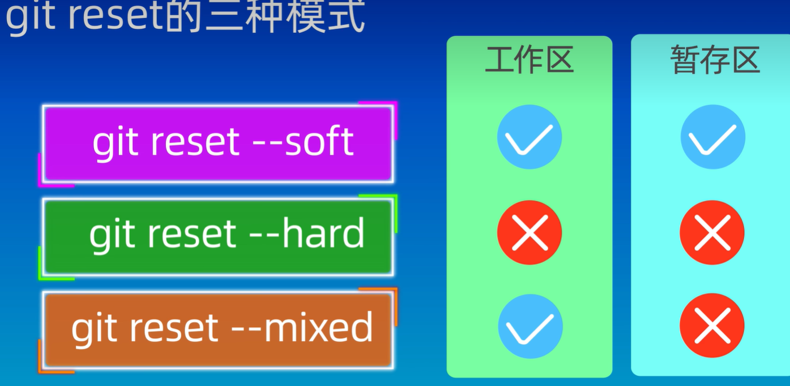

# Git

## 查看git版本

```pseudocode
git -v
```


## 设置用户信息

### 设置用户名称

```pseudocode
git config --global user.name "Lunite"
```

用户名中没有空格，可以不加双引号。

### 设置用户邮箱

```pseudocode
git config --global user.email lunitemargatroid@gmail.com
```

### 储存用户名密码

```pseudocode
git config --global credential.helper store
```

### 查看配置信息

```pseudocode
git config --global --list
```


## 代码仓库/版本仓库 Repository

reopsitory [英]/rɪˈpɒzətri/  [美]/rɪˈpɑːzətɔːri/

简称 repo

### 创建仓库

#### 初始化仓库

在目标文件夹下输入以下指令。

```pseudocode
git init
```

以下指令在当前目录下创建一个目录。

```pseudocode
mkdir "folder"
```

以下命令创建一个目录，并初始化为git仓库。

```pseudocode
git init "my_repo"
```


#### 克隆仓库

```pseudocode
git clone "连接"
```

以下指令将"5.2.STG"仓库克隆至本地。

```pseudocode
git clone https://github.com/Lunite-Margatroid/5.2.STG.git
```

## 文件状态


### 查看当前仓库状态

```pseudocode
git status
```

### 添加到暂存区

```pseudocode
git add "file"
```

### 从暂存区移除

```pseudocode
git rm --cached "file"
```

### 将暂存区中的文件提交

```pseudocode
git commit -m "提交信息"
```

### 查看暂存区文件

```pseudocode
git ls-files
```


### 同时完成add&commit

只能更新仓库中已有的文件，不能添加新文件。

```pseudocode
git commit -a -m "msg"
git commit -am "msg"
```


### 通配符

将当前目录下所有cpp文件添加到暂存区

```pseudocode
git add *.cpp
```

### 批量添加

将当前目录下所有文件添加到暂存区

```pseudocode
git add .
```

### 查看提交记录

```pseudocode
git log
git log --oneline
```

## git diff

默认查看**工作区**和**暂存区**的差异

### 查看工作区与版本库的差异

```pseudocode
git diff HEAD
```

### 查看暂存区与版本库的差异

```pseudocode
git diff -cached
```

### 查看版本之间的差异

```pseudocode
git diff <版本id before> <版本id after>
```

### 使用HEAD参数

将某一个版本与最新版本比较

```pseudocode
git diff <版本id before> HEAD
```

比较最新的两个版本的差异

```pseudocode
git diff HEAD~ HEAD
git diff HEAD^ HEAD
```

比较最新版本和HEAD之前的__两个__版本的差异

```pseudocode
git diff HEAD~2 HEAD
```

### 使用文件名参数

比较最新版本和HEAD之前两个版本的差异，只显示文件application.cpp的差异。

```pseudocode
git diff HEAD~2 HEAD application.cpp
```


## 回退到某个版本



--mixed 是默认参数

指令后边加版本id或者加HEAD^

版本id课通过git log --oneline来查看

```pseudocode
git reset <版本id>
git reset HEAD^
```

### 查看历史操作

```pseudocode
git reflog
```


### 将多次提交合并

多次使用git reset --soft , 已提交文件进入暂存区，然后commit一次。

也可以多次使用git reset --mixed，当前已提交文件文件失去追踪，重新全部add然后再commit一次。

### git reset --hard

谨慎使用，已提交的文件会消失。

如果当前版本出错，想要回退到前一个版本并查看代码，只能用git reset --hard

## Checkout

### 切换分支

```pseudocode
git checkout [batchname]
```

### 创建并切换分支

```pseudocode
git checkout -b [batchname]
```

### 放弃修改

相当于恢复到最近一次add到暂存区的状态

#### 放弃单个文件的修改

```pseudocode
git checkout -- [filename]
```

#### 放弃全部修改

```pseudocode
git checkout .
```

#### 放弃暂存区和工作区的改动

```pseudocode
git checkout -f
```


## 删除文件

### methord 1

手动删除文件

add更新状态

commit提交

### methord 2

先后执行以下命令

```pseudocode
git rm <file>
git commit -m "msg"
```

### 仅从版本库和暂存区删除

保留本地文件

```pseudocode
git rm --cached <file>
```

## gitignore

控制不被git管理的文件类型。

在工作目录创建.gitignore的文本文件，填写忽略的文件名或者文件类型。

如*.txt 忽略素有txt类型的文件。

也可以添加folder的名称，然后忽略整个folder.

如 “temp/“

该文件的编写还有很多匹配模式，需要的时候自行查找。

### 一个gitignore的例子

```pseudocode
/*							# 忽略当前目录下所有文件
!.gitignore					# 不忽略.gitignore
!/OpenGL011/				# 不忽略 ./OpenGL011目录下的文件
/OpenGL011/*				# 忽略   ./OpenGL011目录下的所有文件
!/OpenGL011/src/			# 不忽略 ./OpenGL011/src 目录下的文件
/OpenGL011/res/*			# 忽略   ./OpenGL011/res 目录下的所有文件
!/OpenGL011/res/shader/		# 不忽略 ./OpenGL011/res/shader 目录下的文件

```


## 远程仓库

### clone

1. 回到根目录

```pseudocode
cd
```

就是用户目录

2. 创建.ssh文件

```pseudocode
mkdir .ssh
```

用资源管理器创建应该是一样的

3. 生成密钥

```pseudocode
ssh-keygen -t rsa -b 4096
```

-t rsa 协议为rsa

-b 4096 大小为4096

4. 输入密钥文件名称
4. 输入密码

> 第一次测试密钥的名称是testKey01
>
> 密码是:a534830021

生成两个文件testKey01和testKey01.pub

6. 打开文件testKey01.pub 复制其内容
6. 在github上，new SSH key 将复制的内容粘贴到key
6. 在.ssh目录下添加config文件

```pse
# github
Host github.com
HostName github.com
PreferredAuthentications publickey
IdentityFile ~/.ssh/testKey01
```

指定使用ssh key的时候采用testKey01

9. clone

```pseudocode
git clone "SSH URL"
```

### 将本地仓库托管到远程仓库

1. 创建一个新的空仓库
1. git remote add

把当前仓库关联到目标远程托管仓库。

```pseudocode
git remote add origin https://github.com/Lunite-Margatroid/testRepo001.git
```

origin是远程仓库的别名，与仓库的title无关。

查看当前关联的远程仓库。

```pseudocode
git remote -v
```

指定分支名称

```pseudocode
git branch -M main
```

3. git push

```pseudocode
git push -u origin <本地分支>:<远程仓库分支>
```

-u 是upstream

origin是远程仓库的别名

若本地分支和远程仓库分支名称一样，只用写一个。

#### git官网这么写的

```pseudocode
git remote add origin git@github.com:Lunite-Margatroid/OpenGLMemo.git
git branch -M main
git push -u origin main
```


### 将远程仓库的修改pull到本地

```pseudocode
git pull <远程仓库名称> <远程仓库分支>:<本地仓库分支>
```

远程仓库名称就是那个默认叫origin的东西。如果省略后面的参数，默认为origin mian:main

__注意使用ssh-url__

## 分支管理

### 创建分支

```pseudocode
git branch <分支名>
```

### 查看仓库的所有分支

```pseudocode
git branch
```

### 切换分支

```pseudocode
git checkout <分支名>
git switch <分支名>
```

### 合并分支

将目标分支合并到当前分支

```pseudocode
git merge <分支名>
```

将当前分支的修改添加到指定分支的后面(HEAD)。

```pseudocode
git rebase <分支名>
```


### 显示分支图

```pseudocode
git log --graph --oneline --decorate --all
```

### 删除已合并分支

```pseudocode
git branch -d <分支名>
```

### 强制删除分支

```pseudocode
git branch-D <分支名>
```

## 分支冲突问题

如果分支产生冲突，合并的时候回弹出提示。

使用以下命令查看分支冲突。

windows版本下好像不会阻止合并？


## 杂项

### 指令类型

```pseudocode
--global
--system
```

global是全局设置，对所有仓库有效。

system 系统设置，对所有用户有效。

(default: local) 本地配置，只对本地仓库有效。

### vim

i键 进入编辑模式

esc 退出编辑模式 进入命令模式

:wq （命令） 保存并退出

### 查看暂存区和仓库的文件

```pseudocode
git ls-files
```

### 定义指令别名

输入以下指令后，可以使用graph代替git log --graph --oneline --decorate --all

```pseudocode
alias graph="git log --graph --oneline --decorate --all"
```

### 不要同时提交.gitignore的修改和其他文件的修改
